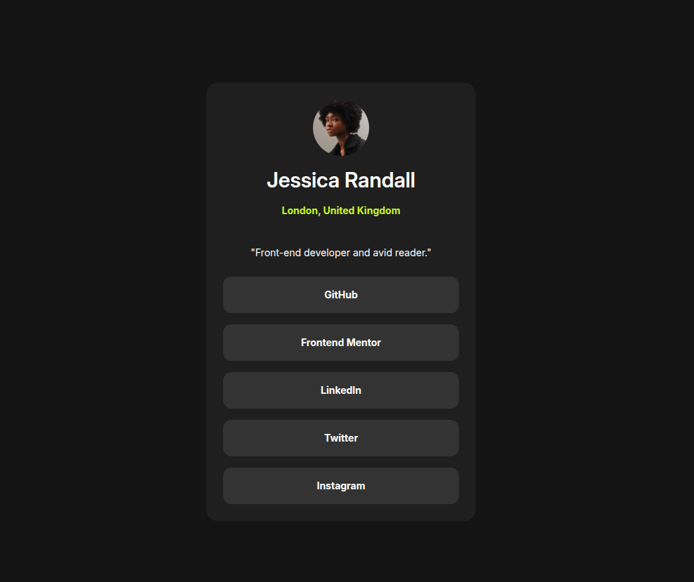

# Frontend Mentor - Social links profile solution

This is a solution to the [Social links profile challenge on Frontend Mentor](https://www.frontendmentor.io/challenges/social-links-profile-UG32l9m6dQ). Frontend Mentor challenges help you improve your coding skills by building realistic projects.

## Table of contents

- [Overview](#overview)
  - [The challenge](#the-challenge)
  - [Screenshot](#screenshot)
  - [Links](#links)
- [My process](#my-process)
  - [Built with](#built-with)
  - [What I learned](#what-i-learned)
  - [AI Collaboration](#ai-collaboration)
- [Author](#author)

## Overview

### The challenge

Users should be able to:

- See hover and focus states for all interactive elements on the page

### Screenshot

### Links

- Live Site URL: [Solution](https://benzzokrugger.github.io/social-links-profile/)

## My process

### Built with

- Semantic HTML5 markup
- Flexbox
- Tailwind
- Mobile-first workflow

### What I learned

This challenge was quite easy and quickly done, since the design is repeatable with my other 2 challenges:

- [QR component challenge](https://github.com/BenzzoKrugger/fm-qr-component)
- [Block preview card](https://github.com/BenzzoKrugger/fm-block-preview-card)

### AI Collaboration

I managed to finish this challenge without AI help. I used AI only for final check and the result was pretty good 🎉

## Author

- Website - [Benzzo](https://www.benzzo.cz)
- Frontend Mentor - [@BenzzoKrugger](https://www.frontendmentor.io/profile/BenzzoKrugger)
